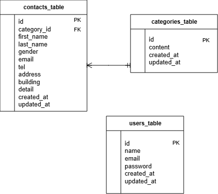

# お問い合わせフォーム

## 環境構築

1. Dockerビルド・起動

プロジェクトのルートディレクトリで以下のコマンドを実行します。
```bash
$docker compose build
$docker compose up -d
```

2. PHPコンテナに入る
```bash
$docker compose exec php bash
```

3. Composerパッケージのインストール
```bash
$composer install
```

4. .envファイルの設定

.envファイルを作成し、データベースの接続情報を設定します。

```bash
DB_CONNECTION=mysql DB_HOST=mysql DB_PORT=3306 DB_DATABASE=laravel_db DB_USERNAME=laravel_user DB_PASSWORD=laravel_pass
```

5. アプリケーションキー

```bash
$php artisan key:generate
```

6. マイグレーションの実行

```bash
$php artisan migrate
```

7. シーディングの実行

```bash
php artisan db:seed
```

※ categoriesテーブルにお問い合わせの種類を5件登録します。

8. アプリケーションへのアクセス

ブラウザから以下にアクセスします。

http://localhost/


## 使用技術（実行環境）
- PHP 8.5.5
- Laravel 8.83.29
- MySQL 8.0.26
- Nginx
- Docker 28.1.1
- Docker Compose v2.35.1

## ER図


## URL

開発環境：http://localhost/